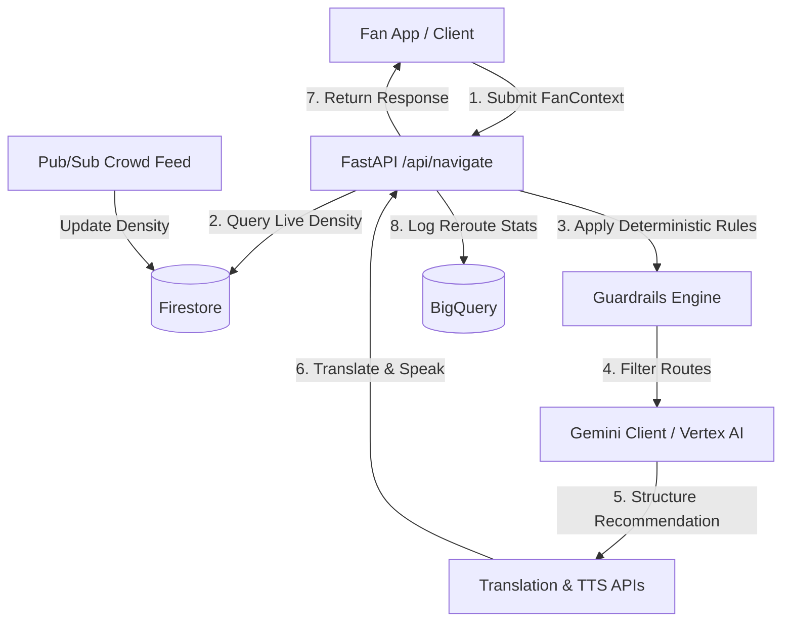

# StadiumSense AI

StadiumSense AI is a fan navigation and crowd management platform designed for the **FIFA World Cup 2026**. It uses a single GenAI-powered decision engine that integrates real-time crowd density feeds and fan context to deliver safe, multilingual, and accessibility-aware navigation paths.

---

## Chosen Vertical
**Vertical:** Fan Navigation & Crowd Management  
**Persona:** "The Fan" — a ticket-holder approaching or navigating inside the stadium on match day.

Rather than implementing fragmented, disconnected features, StadiumSense AI uses **one persona with one decision engine**. Accessibility requirements, ticket zones, current location, and preferred languages are context parameters passed to a single backend reasoning engine. Every client request submits a unified `FanContext` and receives a single, cohesive navigation recommendation: **where this fan should go right now, and why.**

---

## Problem
On match days, fans face critical navigation challenges:
- Difficulty finding the fastest and safest routes to seats/gates amid dynamic, high-density crowds.
- Difficulty finding specialized accessibility routes (wheelchair ramps, elevators, low-sensory corridors) which are often buried in static stadium maps.
- Lack of immediate, multilingual translation of safety and route guidance in the fan's native language.
- Under-informed stadium operations staff unable to handle massive ingress volumes at peak hours.

StadiumSense AI resolves this by coupling deterministic safety guardrails with Gemini reasoning.

---

## Architecture

### System Workflow


### GCP Services Applied

| GCP Service | Purpose / Implementation |
|---|---|
| **Vertex AI (Gemini 2.5 Flash)** | Core reasoning engine — route explanation and structured recommendation generation over guardrail-filtered candidates. |
| **Cloud Run** | Hosts the unified FastAPI Docker container (API & static frontend assets). |
| **Firestore** | Stores real-time `CrowdSnapshot` documents, stadium zones/gates, and fan sessions. |
| **Cloud Translation API** | Automatically translates route descriptions and safety text into the fan's preferred language. |
| **Text-to-Speech (TTS) API** | Generates spoken audio instructions for visually impaired or low-literacy fans. |
| **Cloud Pub/Sub** | Ingests real-time simulated crowd-density updates to keep Firestore state current. |
| **BigQuery** | Receives route logs and rerouting event metrics for operational dashboard analytics. |
| **Secret Manager** | Secures API keys, GCP credentials, and server secrets. |
| **Cloud Storage** | Stores stadium map assets and generated Text-to-Speech audio files. |
| **Cloud Logging & Monitoring** | Traces request execution, tracks latency metrics, and triggers operational alerts. |

---

## Core Decision Logic

### The Split: Guardrails vs. Gemini Reasoning
Safety-critical routing decisions must be deterministic, auditable, and 100% reliable. StadiumSense AI separates deterministic policy enforcement from LLM reasoning:

1. **Deterministic Guardrails (Execution Stage 1):**
   - **Incident Exclusion:** Never route a fan through any zone marked with active security/safety incidents.
   - **Mobility Matching:** If `mobility_needs != none`, only accessible-tagged pathways are eligible.
   - **Crowd Density Rerouting:** If a zone's density exceeds `85%`, it is automatically dropped from the route candidate list.
   These rules run in plain Python, are 100% unit-tested, and execute *before* calling the LLM.

2. **Gemini Reasoning (Execution Stage 2):**
   - Gemini receives only the *filtered, safe, and eligible candidate routes*.
   - The model reasons over the best path (balancing gate queue times and zone density) and explains *why* the route is recommended in a natural, welcoming tone.
   - Using **function-calling**, Gemini returns a strictly-formatted JSON payload matching our Pydantic schema.

This split ensures safety-critical operations never suffer from LLM hallucinations, while still leveraging GenAI for high-quality, personalized reasoning and multilingual output.

---

## How It Works (End-to-End Flow)
1. **Request Ingress:** A client POSTs `FanContext` to `/api/navigate`.
2. **Context Enrichment:** The backend retrieves current crowd densities for the relevant zones from Firestore.
3. **Guardrails Filtering:** Deterministic rules prune dangerous, congested, or non-accessible routes.
4. **Gemini Reasoning:** Gemini evaluates the remaining safe routes and generates route reasoning.
5. **Localization & Accessibility Output:**
   - Cloud Translation translates the instructions into the fan's `preferred_language`.
   - If the fan has accessibility needs (e.g. visual or sensory sensitivity), the TTS engine produces a spoken audio file, uploaded to Cloud Storage.
6. **Response Egress:** The API returns a unified `NavigationResponse` structure to the client.
7. **Operational Log:** A background thread logs the transaction to BigQuery for analytics.

---

## Assumptions
* Real-time crowd density is simulated via a background Pub/Sub runner for demo/validation purposes; a production version would consume feeds from IoT stadium gate turnstiles and CCTV crowd analytics.
* Local runtime falls back to mock service implementations when `USE_MOCKS=true` is enabled, eliminating GCP dependency during development.

---

## Setup & Local Run

### Prerequisites
* Python 3.12+ (Python 3.14 recommended)
* Node.js 18+ and npm

### Backend Setup
1. Navigate to the project root and activate the virtual environment:
   ```bash
   python3 -m venv venv
   source venv/bin/activate
   pip install -r backend/requirements.txt
   ```
2. Copy `.env.example` to `.env` and configure settings:
   ```bash
   cp .env.example .env
   ```
   *(Ensure `USE_MOCKS=true` is set to run without active GCP service credentials)*

3. Start the FastAPI server:
   ```bash
   PYTHONPATH=backend uvicorn app.main:app --host 127.0.0.1 --port 8080 --reload
   ```
   The API will be available at `http://127.0.0.1:8080`. API documentation can be viewed at `http://127.0.0.1:8080/docs`.

### Frontend Setup
1. Navigate to the `frontend/` directory:
   ```bash
   cd frontend
   npm install
   ```
2. Run the Vite development server:
   ```bash
   npm run dev
   ```
   Vite will start the frontend app at `http://localhost:5173`. Any API calls to `/api/*` are proxied to the backend at `http://127.0.0.1:8080`.

---

## Deployment (Cloud Run)
The application is configured to deploy as a single container to Cloud Run. The multi-stage [Dockerfile](file:///home/kapil31jangid/stadiumos-ai/Dockerfile):
1. Builds the static React frontend app (`dist/` directory).
2. Copies the static assets into the Python backend runtime image under `app/static`.
3. Serves the unified API and static assets from Uvicorn on port `8080`.

To deploy via Google Cloud Build:
```bash
gcloud builds submit --config cloudbuild.yaml
```

---

## Testing
To run the automated Python backend tests:
```bash
PYTHONPATH=backend ./venv/bin/pytest backend/tests
```

To run frontend builds:
```bash
cd frontend && npm run build
```

---

## Security Notes
* **Deterministic Pre-Filtering:** Prevents LLM hallucinations from routing users through active incident or safety zones.
* **Strict Schema Enforcement:** FastAPI uses Pydantic to validate client requests and API responses at the network boundary.
* **Secret Management:** Sensitive configurations are loaded via environment variables or Secret Manager, never committed to git.
* **Data Minimization:** No personally identifiable information (PII) is stored; sessions are tracked using transient `fan_id` strings.

---

## Accessibility Notes
* **Text-to-Speech:** Generates localized spoken instructions for visually impaired and low-literacy users.
* **Accessible Routes:** Deterministic routing excludes stairs, escalators, and crowded zones for fans specifying wheelchair or limited mobility context.
* **Frontend Accessibility:** Built with high-contrast color styling, semantic HTML5 tags, keyboard navigation capabilities, and complete ARIA attributes.
