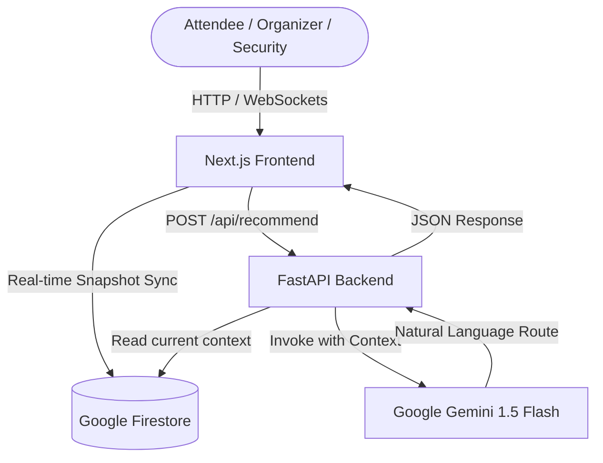
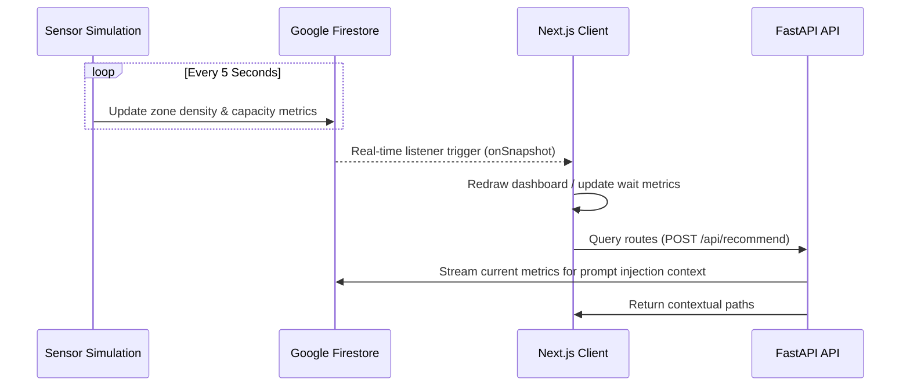
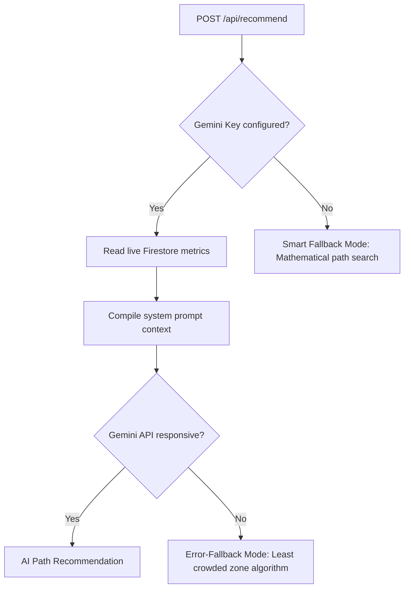
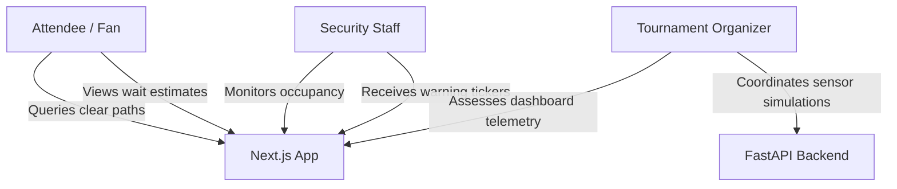
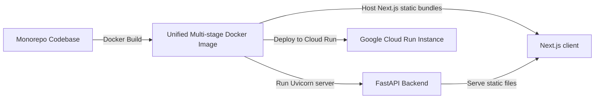

# StadiumOS AI

**The AI-Powered Stadium Operating System for the FIFA World Cup 2026**

---

## 🛡️ Repository Badges

[](https://github.com/kapil31jangid/crowdsense-ai.git)
[](https://crowdsense-ai-kjmupfekoq-ew.a.run.app)
[](https://console.cloud.google.com/run/detail/europe-west1/crowdsense-ai?project=promptwars-stadium-ai)
[](https://opensource.org/licenses/MIT)

[](https://nextjs.org/)
[](https://fastapi.tiangolo.com/)
[](https://firebase.google.com/)
[](https://deepmind.google/technologies/gemini/)
[](https://www.docker.com/)
[](https://www.python.org/)
[](https://www.typescriptlang.org/)
[](https://tailwindcss.com/)

---

## ✨ Repository Highlights

* **✓ AI-powered Stadium Operations**: Real-time path recommendations explaining the safest and quickest routes inside the venue.
* **✓ Real-time Crowd Intelligence**: Automated density sensors monitoring and updating concourse bottlenecks.
* **✓ AI Navigation**: Interactive SVG stadium map with click-to-route and search capabilities.
* **✓ Google Gemini Integration**: Leverages state-of-the-art Google Gemini 1.5 Flash models to drive pathfinding reasoning.
* **✓ Firebase Real-time Synchronization**: Instant data sync between simulated field sensors and live client dashboards.
* **✓ FastAPI Backend**: Scalable, high-performance, asynchronous REST API serving live telemetries and the LLM engine.
* **✓ Next.js Frontend**: Dynamic, responsive Next.js 16 dashboard optimized for spectator monitoring.
* **✓ Docker Deployment**: Multi-stage unified container setup ready for Google Cloud Run deployment.

---

## 📖 Executive Summary

Managing large-scale stadiums during a premier global event like the FIFA World Cup 2026 presents massive logistics, safety, and operational challenges. Thousands of spectators must navigate gates, concourses, concessions, and transportation under strict security guidelines.

**StadiumOS AI** solves these coordination problems by serving as the central nervous system for stadium management. Rather than relying on static signage or isolated monitoring tools, StadiumOS AI fuses real-time database updates with Generative AI. This allows the system to analyze live conditions, predict queue delays, suggest alternate routes, and dynamically assist event organizers, security personnel, volunteers, and fans through a single unified interface.

---

## 🎯 Problem Statement

During major tournaments, stadium operations face several friction points:
1. **Crowd Congestion**: High density at bottlenecks (gates, main concourses) increases safety risks and compromises spectator comfort.
2. **Dynamic Navigation Bottlenecks**: Standard routing apps do not account for fluid crowd movements, gate closures, or security incidents inside the venue.
3. **Operational Silos**: Volunteers, security staff, and organizers lack a unified, live source of truth for stadium occupancy and crowd movement.
4. **Accessibility Hurdles**: Disabled spectators require real-time updates on wheelchair access routes, elevator traffic, and accessible pathways.

---

## 🤖 Why Generative AI?

Traditional operational systems use hardcoded threshold rules (e.g., *"If density > 80%, send alert"*). While useful, these rules lack context and reasoning capabilities. 

StadiumOS AI utilizes **Generative AI** (Google Gemini) because:
* **Contextual Pathfinding**: It interprets complex, natural-language route requests in the context of multi-zone density lists (e.g., finding the safest route to the Food Court by skipping the VIP Lounge due to high occupancy).
* **Dynamic Explanation**: It doesn't just block a route; it provides brief, reasoned explanations to the user based on live telemetry (e.g., *"Take the East Concourse instead because Gate A is currently experiencing a 45-minute queue delay"*).
* **Extensible Reasoning**: The system can ingest unstructured safety logs or incident reports and summarize them for organizers, making the interface highly interactive and adaptive.

---

## 🌐 Live Demo

You can interact with the live deployment and explore the code architecture below:

* **Live Deployment**: [stadiumos-ai.run.app](https://crowdsense-ai-kjmupfekoq-ew.a.run.app)
* **GitHub Repository**: [kapil31jangid/stadiumos-ai](https://github.com/kapil31jangid/crowdsense-ai.git)
* **Demo Video**: *[Link placeholder - Demo video coming soon]*
* **Interactive Architecture**: *[Visual diagram detailed in the System Architecture section]*

---

## 📸 Screenshots

Below are placeholders representing the primary user interfaces of StadiumOS AI:

### Dashboard
> *[Visual Placeholder: Add dashboard view screenshot here. Displays the Live Ticker layout, Critical Update Banner, Digital Pass details, live countdown timer, and interactive itinerary timeline.]*

### Crowd Intelligence
> *[Visual Placeholder: Add crowd density view screenshot here. Displays the list of zones with live capacity bars and status alerts.]*

### AI Navigation & Map
> *[Visual Placeholder: Add map screenshot here. Displays the interactive SVG stadium blueprint with active pins, Gates location markers, and concession stands wait estimates.]*

### AI Assistant Chat Drawer
> *[Visual Placeholder: Add AI chatbot screenshot here. Shows the sliding right-hand AI decision drawer responding to natural language pathfinding prompts.]*

---

## ⚙️ System Architecture Diagrams

### 1. High-Level Architecture


### 2. Sensor Data & Real-Time Sync Flow


### 3. Gemini Decision & Fallback Flow


### 4. Role Interaction Flow


### 5. Deployment Flow


---

## 🛠️ System Features Table

| Capability | Status | Technical Notes |
| :--- | :--- | :--- |
| **Live Crowd Monitoring** | 🟢 Implemented | Real-time zone density tracking, automatic "Congested"/"Critical" status transitions, live metrics sync via Firestore. |
| **AI Navigation** | 🟢 Implemented | Path recommendations with real-time zone-data injected as LLM system context. Includes a mathematical **Intelligent Data Fallback Mode** when the LLM API is offline. |
| **Operations Center** | 🟢 Implemented | Interactive dashboard showing average occupancy, live alert tickers, list metrics, and simulated concession queues. |
| **Interactive Map** | 🟢 Implemented | Embedded SVG map showing concentric seating sections, playing pitch, and interactive selected pins. |
| **Role-Based Dashboards** | 🟢 Implemented | Custom dashboards for Fans, Volunteers, Security, Organizers, and Venue Staff with quick Demo login mocks. |
| **Multilingual Translation**| 🟢 Implemented | Core dictionary translation supporting English, Spanish, French, Arabic, Hindi, and Japanese. |
| **AI Announcement Generator**| 🟢 Implemented | Generates multilingual public warnings, security briefings, and volunteer briefs. |
| **Accessibility Assistant**| 🟢 Implemented | Renders path filters, text scaling parameters, and contrast settings. |
| **Incident Management** | 🟢 Implemented | Incident logger + Gemini automated risk summary and Suggested Response. |
| **Sustainability Center** | 🟢 Implemented | Utility tracking and green HVAC optimization recommendations. |
| **Transport Intelligence** | 🟢 Implemented | Live metro waits and AI exit path recommendations. |
| **Firebase Live Sync** | 🟢 Implemented | Frontend clients listen to changes in Firestore data, updating views in real time. |
| **Docker Packaging** | 🟢 Implemented | Unified Docker multi-stage container configuration. |
| **Vitest & Pytest Suite** | 🟢 Implemented | Active backend FastAPI route validation tests and frontend navbar layout tests. |
| **Digital Twin Visualization** | 🟣 Planned | 3D visual render overlays showing density heatmaps. *(Future Scope)* |
| **Computer Vision Turnstiles** | 🟣 Planned | Integrating security camera object detection feeds to estimate gate occupancy. *(Future Scope)* |

---

## 🔌 API Documentation

### 1. Health Status
* **Method**: `GET`
* **Route**: `/api/health`
* **Purpose**: Verifies backend availability, database connection, and Gemini configuration.
* **Request**: None
* **Response (Success - `200 OK`)**:
  ```json
  {
    "status": "online",
    "model": "gemini-1.5-flash",
    "db": "connected"
  }
  ```

### 2. Live Metrics Snapshot
* **Method**: `GET`
* **Route**: `/api/metrics`
* **Purpose**: Retrieves a summarized snapshot of all active stadium zones, occupancy rates, and critical density areas.
* **Request**: None
* **Response (Success - `200 OK`)**:
  ```json
  {
    "overall_occupancy": 0.33,
    "zone_count": 5,
    "high_density_alerts": [],
    "status": "Normal"
  }
  ```

### 3. AI Navigation Recommendation
* **Method**: `POST`
* **Route**: `/api/recommend`
* **Purpose**: Submits location parameters to the Gemini LLM engine to get path guidance based on live metrics.
* **Request Body**:
  ```json
  {
    "user_location": "East Gate A",
    "destination": "Central Plaza Food Court"
  }
  ```
* **Response (Success - `200 OK` - AI Mode)**:
  ```json
  {
    "recommendation": "The Level 1 Concourse is currently 45% full. Take the main route directly as East Gate A is experiencing normal flow. Avoid the Central Plaza Food Court as it is currently busy (65% full).",
    "status": "Success"
  }
  ```

### 4. Multilingual Announcement Generator
* **Method**: `POST`
* **Route**: `/api/announcements/generate`
* **Purpose**: Organizer logs an incident, and Gemini writes alerts, instructions, security briefs, and translations.
* **Request Body**:
  ```json
  {
    "incident": "Crowd Bottleneck",
    "location": "Gate C",
    "severity": "High"
  }
  ```
* **Response (Success - `200 OK`)**:
  ```json
  {
    "public_announcement": "ALERT: Crowd bottleneck reported near Gate C. Proceed with caution.",
    "volunteer_instructions": "Monitor Gate C area and guide crowd towards Gate D.",
    "security_brief": "Deploy crowd control units to Concourse B Gate C.",
    "translations": {
      "en": "ALERT: Crowd bottleneck near Gate C.",
      "es": "ALERTA: Embotellamiento de gente cerca de la Puerta C."
    }
  }
  ```

### 5. Log & Analyze Incident
* **Method**: `POST`
* **Route**: `/api/incidents`
* **Purpose**: Saves new incident reports to Firestore and evaluates mitigation guidelines using Gemini.
* **Request Body**:
  ```json
  {
    "type": "Medical Emergency",
    "location": "Concourse B",
    "severity": "Critical",
    "description": "Attendee experiencing heat stroke"
  }
  ```
* **Response (Success - `200 OK`)**:
  ```json
  {
    "summary": "Attendee experiencing heat stroke near Concourse B.",
    "priority": "HIGH",
    "suggested_response": "Deploy standard medical responders to Concourse B immediately."
  }
  ```

### 6. Sustainability Green Settings Recommendations
* **Method**: `GET`
* **Route**: `/api/sustainability/recommendations`
* **Purpose**: Gemini evaluates facility loads and returns resources optimization list.
* **Request**: None
* **Response (Success - `200 OK`)**:
  ```json
  {
    "recommendations": [
      "Reduce concourse overhead lighting during high daylight hours.",
      "Stagger HVAC startup cycles to avoid power demand spikes."
    ]
  }
  ```

### 7. Facility Maintenance Suggestions
* **Method**: `GET`
* **Route**: `/api/venue/maintenance`
* **Purpose**: Gemini estimates equipment load and returns preventative servicing guidelines.
* **Request**: None
* **Response (Success - `200 OK`)**:
  ```json
  {
    "suggestions": [
      "Monitor elevator cabin vibration levels in Section 102.",
      "Service entrance Gate B turnstile bearings before halftime surge."
    ]
  }
  ```

---

## ⚙️ Environment Variables & Configuration

The application requires configuration via environment files. Never commit production credentials.

### Backend Configurations (`backend/.env`)

| Variable Name | Required | Description | Default/Fallback |
| :--- | :--- | :--- | :--- |
| `GOOGLE_API_KEY` | Yes (for AI) | Google Gemini API access key. | Uses mathematical fallback algorithm if absent. |
| `FIREBASE_SERVICE_ACCOUNT_PATH` | No | Path to JSON service credential file. | Attempts to use GCP Application Default Credentials. |

### Frontend Configurations (`frontend/.env`)

| Variable Name | Required | Description | Fallback (Build-Safe) |
| :--- | :--- | :--- | :--- |
| `NEXT_PUBLIC_FIREBASE_API_KEY` | Yes | Firebase client API key. | `AIzaSyDummyKeyForBuildTimePrerendering` |
| `NEXT_PUBLIC_FIREBASE_AUTH_DOMAIN` | Yes | Firebase authentication domain. | `dummy-project.firebaseapp.com` |
| `NEXT_PUBLIC_FIREBASE_PROJECT_ID` | Yes | Firebase project ID. | `dummy-project` |
| `NEXT_PUBLIC_FIREBASE_STORAGE_BUCKET`| Yes | Storage bucket URL. | `dummy-project.appspot.com` |
| `NEXT_PUBLIC_FIREBASE_MESSAGING_SENDER_ID`| Yes | Messaging service ID. | `1234567890` |
| `NEXT_PUBLIC_FIREBASE_APP_ID` | Yes | Firebase Web App ID. | `1:1234567890:web:1234567890` |

---

## 🚀 Setup & Local Development

### 📋 Prerequisites
* **Python**: `3.9` or higher
* **Node.js**: `18.x` or higher
* **Docker**: Deployed for local container testing
* **Firebase Account**: Access to a Firestore database instance

### 1. Setup Backend (FastAPI)
1. Navigate to the backend directory:
   ```bash
   cd backend
   ```
2. Create and activate a Python virtual environment:
   ```bash
   python3 -m venv venv
   source venv/bin/activate
   ```
3. Install the dependencies:
   ```bash
   pip install -r requirements.txt
   ```
4. Create a `.env` file referencing your keys:
   ```env
   GOOGLE_API_KEY="your-gemini-key"
   FIREBASE_SERVICE_ACCOUNT_PATH="stadiumos-firebase-cred.json"
   ```
5. Spin up the API server:
   ```bash
   python3 main.py
   ```
   *The server mounts on `http://localhost:8080`.*

### 2. Setup Frontend (Next.js)
1. Navigate to the frontend directory:
   ```bash
   cd frontend
   ```
2. Install package dependencies:
   ```bash
   npm install
   ```
3. Create a `.env` file referencing your project:
   ```env
   NEXT_PUBLIC_FIREBASE_API_KEY="your-key"
   NEXT_PUBLIC_FIREBASE_AUTH_DOMAIN="stadiumos.firebaseapp.com"
   NEXT_PUBLIC_FIREBASE_PROJECT_ID="stadiumos"
   NEXT_PUBLIC_FIREBASE_STORAGE_BUCKET="stadiumos.appspot.com"
   NEXT_PUBLIC_FIREBASE_MESSAGING_SENDER_ID="sender-id"
   NEXT_PUBLIC_FIREBASE_APP_ID="app-id"
   ```
4. Start the frontend developer server:
   ```bash
   npm run dev
   ```
   *Open `http://localhost:3000` to interact with the system.*

### 3. Run Sensor Simulation
To simulate live stadium sensors updating density values in Firestore, run:
```bash
cd backend
source venv/bin/activate
python3 simulate_crowd.py
```

---

## 🛡️ Security Audit
* **Secrets Separation**: All keys are isolated in local environments via `.env` configurations.
* **Safe Prompts**: System prompt parameters wrap live Firestore data and strictly sanitize attendee inputs to prevent prompt injection.
* **Pydantic Validation**: Backend models enforce strict string length checks to protect routes from overflow payloads.
* **CORS Restrictions**: API configuration enforces restricted domains (`localhost:3000`, Cloud Run links) for REST queries.

---

## ♿ Accessibility (a11y)
* **Semantic Markups**: Dashboard navigation, lists, and forms leverage semantic tags (`role="navigation"`, `role="log"`, etc.).
* **Keyboard Accessible**: Includes skip-links and tab navigation compatibility.
* **High Contrast**: Complies with contrast standards, utilizing a slate-black backdrop combined with high-visibility cyan and lime accents.
* **Screen Reader Friendly**: Critical alerts push screen-reader notifications immediately via `aria-live` configurations.

---

## 🧪 Testing

### Run Backend API Tests
Backend tests cover API responses, database check exceptions, and pathfinding fallback cases:
```bash
cd backend
PYTHONPATH=. ./venv/bin/pytest tests/test_main.py
```

### Run Frontend Component Tests
Frontend tests run via Vitest, ensuring correct layout mounting and navbar logic:
```bash
cd frontend
npm run test
```

---

## 🔮 Future Roadmap

### Near-Term *(Planned)*
* **Volunteer Hub**: Coordinate task allocation and reporting.
* **Accessibility Path Filters**: Specific routes filtering for wheelchair access.

### Medium-Term *(Designed Architecture)*
* **Emergency Override**: Alert broadcast system pushing evacuation routes to fans.
* **Digital Twin Overlays**: Interactive 3D maps displaying real-time spectator density.

---

## 📊 Evaluation Matrix

For PromptWars judges evaluating this repository:

| Criteria | Level | Implementation Detail |
| :--- | :--- | :--- |
| **Problem Statement** | **High** | Resolves dynamic navigation, accessibility context, and spectator flows. |
| **Code Quality** | **High** | Separation of FastAPI endpoints, LangChain wrappers, and Next.js reactive tabs. |
| **Security** | **Medium** | Isolated environment setups, strict CORS, and Pydantic schemas. |
| **Accessibility** | **Medium** | Skip-links, ARIA tags, and screen reader-friendly live announcement regions. |

---

## 📄 License
This project is licensed under the MIT License - see the [LICENSE](LICENSE) file for details.
